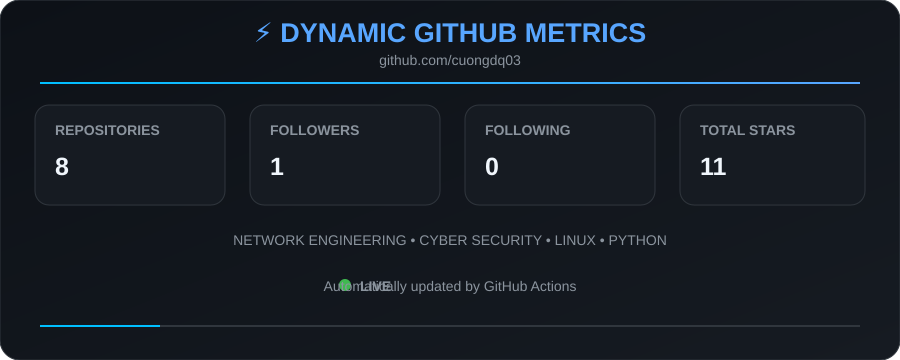

<div align="center">

# 👋 Hi, I'm Quốc Cường

### 🌐 Network Engineer | 🔐 Cyber Security | 🐧 Linux | 🐍 Python


<br>


</div>

---

# 💻 Terminal

```text
$ whoami

Name        : Quốc Cường
Location    : Vietnam
Role        : Information Technology Student

Focus       : Network Engineering & Cyber Security

Learning    : CCNA | Linux | Python | Docker | Network Automation

Goal        : Become a Network & Security Engineer
```

---

# 🚀 About Me

I'm an IT student passionate about **network infrastructure, Linux systems and cyber security**.

I enjoy building labs, troubleshooting network problems, analyzing traffic and automating repetitive tasks with Python.

### 🎯 Main Interests

* 🌐 Enterprise Networking
* 🔐 Network Security
* 🐧 Linux System Administration
* 🐍 Python Network Automation
* ☁️ Cloud Infrastructure
* 📡 5G Core Network
* 🛠️ Network Troubleshooting

> **Learn → Build → Break → Troubleshoot → Automate → Repeat**

---

# 🛠 Tech Stack

## 🌐 Networking

<p align="center">


</p>

### Networking Technologies

```text
TCP/IP
Routing & Switching
VLAN
Trunk
STP
OSPF
BGP
ACL
NAT
DHCP
DNS
VPN
WAN / LAN
Cisco IOS
Wireshark
```

---

## 🐧 Linux

```text
Ubuntu
Rocky Linux
SSH
Bash
Systemd
Cron
NFS
Samba
Apache
Nginx
Docker
LVM
RAID
DNS
Mail Server
```

---

## 🔐 Cyber Security

```text
Network Security
Firewall
UFW
iptables
Nmap
Wireshark
Snort
Suricata
IDS / IPS
OWASP Top 10
Burp Suite
Linux Security
```

---

## 🐍 Programming & Automation

<p align="center">


</p>

```text
Python
C / C++
Bash
Network Automation
Socket Programming
CLI Tools
```

---

# 📂 Featured Projects

| Project                   | Description                                    |
| ------------------------- | ---------------------------------------------- |
| 🌐 **Cisco-Labs**         | VLAN, STP, OSPF, ACL, NAT, DHCP, BGP           |
| 🐧 **Linux-Labs**         | SSH, DNS, DHCP, Apache, Docker, NFS, LVM       |
| 🔐 **Wireshark-Analysis** | TCP, HTTP, DNS, TLS packet analysis            |
| 🐍 **Python-Network**     | Port Scanner, Ping Sweep, SSH Automation       |
| 🛡️ **Network-Security**  | Firewall, Nmap, Snort, Suricata                |
| 📡 **5G-Core**            | AMF, SMF, UPF, NRF, Service-Based Architecture |

---

# 📚 Currently Learning

```text
CCNA                 ███████████████████████░░  90%

Linux Administration █████████████████████░░░░  80%

Python Automation    ███████████████████░░░░░░  75%

Network Security     █████████████████░░░░░░░░  70%

Docker               ███████████████░░░░░░░░░░  60%

DevNet               ███████████░░░░░░░░░░░░░  45%
```

---

# 📊 GitHub Statistics

<div align="center">


</div>

---

# 🔥 GitHub Streak

<div align="center">


</div>

---

# ⚡ Dynamic GitHub Metrics

<div align="center">



</div>

---

# 🐍 Contribution Snake

<div align="center">

<picture>

<source
media="(prefers-color-scheme: dark)"
srcset="https://raw.githubusercontent.com/cuongdq03/cuongdq03/gh-pages/github-contribution-grid-snake-dark.svg">

<source
media="(prefers-color-scheme: light)"
srcset="https://raw.githubusercontent.com/cuongdq03/cuongdq03/gh-pages/github-contribution-grid-snake.svg">


</picture>

</div>

---

# 📈 Contribution Activity

<div align="center">


</div>

---

# 🧠 Network Engineer Mindset

```text
                    ┌───────────────────┐
                    │    USER / HOST    │
                    └─────────┬─────────┘
                              │
                              ▼
                    ┌───────────────────┐
                    │      SWITCH       │
                    │  VLAN / STP / L2  │
                    └─────────┬─────────┘
                              │
                              ▼
                    ┌───────────────────┐
                    │      ROUTER       │
                    │ OSPF / BGP / NAT  │
                    └─────────┬─────────┘
                              │
                              ▼
                    ┌───────────────────┐
                    │     FIREWALL      │
                    │ ACL / IDS / IPS   │
                    └─────────┬─────────┘
                              │
                              ▼
                    ┌───────────────────┐
                    │     INTERNET      │
                    └───────────────────┘
```

---

# 🧪 What I Build

```text
Cisco Networking Labs
        ↓
Linux Server Labs
        ↓
Network Security Labs
        ↓
Python Automation
        ↓
Docker Infrastructure
        ↓
Monitoring & Troubleshooting
        ↓
Real-world Network Engineering
```

---

# 📫 Connect With Me

<div align="center">

📧 **Email**

`duongquoccuongfvt@gmail.com`

<br>

🌐 **GitHub**

`github.com/cuongdq03`

</div>

---

<div align="center">

## ⚡ Philosophy

> **"A good Network Engineer doesn't just configure devices —
> he understands how data flows, why failures happen, and how to secure every packet."**

<br>

### 🚀 Build. Break. Fix. Automate. Repeat.

⭐ **Thanks for visiting my profile!**

</div>
